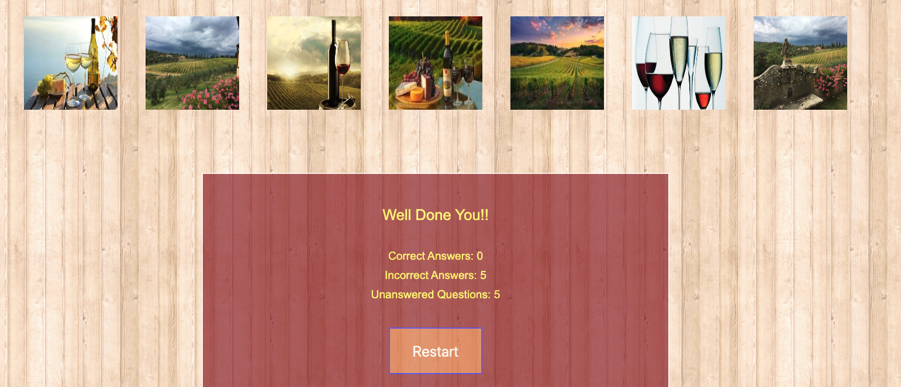

# Are You A Wine Genius?

### Trivia Game Overview

This app was built using JavaScript timers, intervals and jQuery.

### How to play

User is presented with a timed 10-question multiple choice "test" regarding wines, grape varietals, vineyars, appelations etc. The questions are formated using a radio button form. At the end the results are posted.

## Required tools & tech:

- JavaScript (timers)
- jQuery

##### User Prompted to Begin

##### Multiple Choice "Test"

##### Results Displayed

